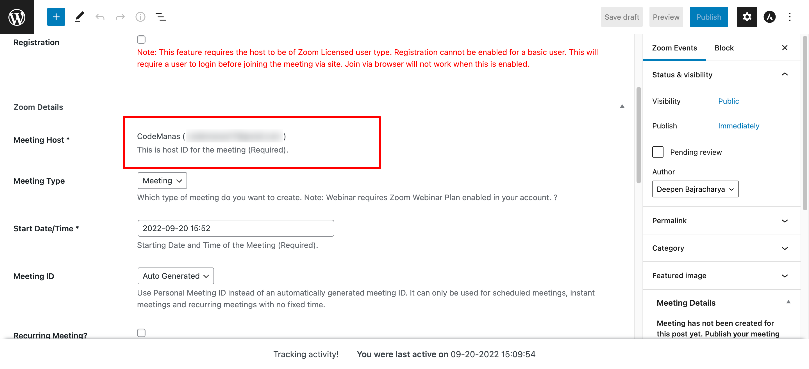

This allows you to link your Users to your WordPress site using the `get_user_meta` function. The purpose is to reduce the need to select a host each time a new meeting is created. So, that in the case of allowing to create meetings via multiple existing users ( for example admin 1 and admin 2) they won't get confused on which host to select.
 
### Setup
 
`define("VIDEO_CONFERENCING_HOST_ASSIGN_PAGE", true);` into your wp-config.php file to enable this menu in wp-admin side.

### How to link Zoom Host to your WordPress Hosts

After completing the setup process, you should see a new option on your wp-admin portal called **"Host to WP users"**. Like show below:

Goto this page and link a Zoom host to your desired WordPress user. 

### How it Works?

After you link the Host to WP user - When trying to create the meeting that user will only see the details that is linked to that account. This way it won't confuse your users and they won't have to choose a host everytime they create a meeting/webinar.

