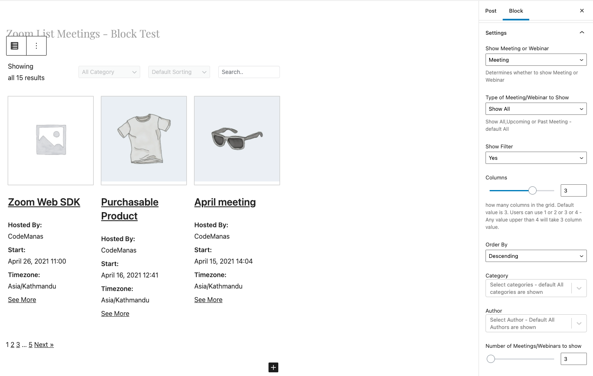
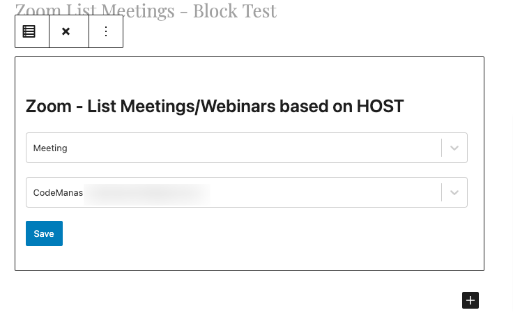
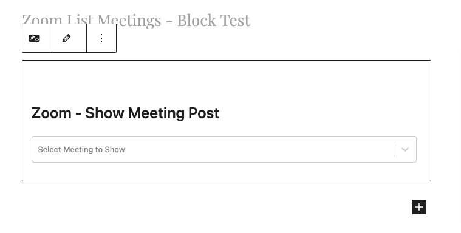
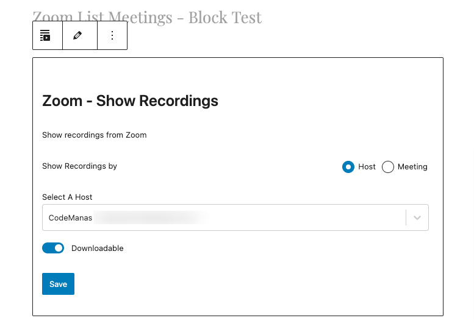

## Introducing Zoom - Zoom Blocks:

Easily and Conveniently add features to your site - using the Zoom Blocks. All Zoom - blocks are under the Zoom Category:

### Types:

1. List Zoom Meetings
2. List Zoom Meeting by Host
3. Direct Meeting or Webinar
4. Embed Zoom Post
5. Zoom - Show Recordings
6. Zoom - Join via Browser

---

### 1. List Zoom Meetings

Search for List Zoom Meeting while entering the block. 
Will allow you to list either Meetings or Webinars that are already available on your site. (From WordPress Created or imported to WordPress)

Settings:

Example Output:

Equivalent Shortcodes:

* [List Meetings](shortcode.md/#3-list-upcoming-or-past-meetings)
* [List Webinars](shortcode.md/#4-list-upcoming-or-past-webinars)

---
### 2. List Zoom Meeting by Host:

Show live - Zoom Meetings or Webinars directly from Zoom (not from WordPress).

Settings:
;

Example Output:

Equivalent Shortcodes:

* [List Meetings](shortcode.md/#5-list-meetings-based-on-host-id)
* [List Webinars](shortcode.md/#7-show-list-of-webinars)
---
### 3. Direct Meeting or Webinar
Show a Zoom Meeting/Webinar directly from Zoom:

Settings:

Example Output:

Equivalent Shortcodes:

* [Direct Meeting](shortcode.md/#1-show-single-zoom-meeting-detail)
* [Direct Webinars](shortcode.md/#6-show-specific-webinar-detail)

---
### 4. Embed Zoom Post
Embed a Zoom Post(Posts are either created or imported into WordPress). 

Settings:

Example Output:

Equivalent Shortcodes:

* [Post with Countdown](shortcode.md/#2-show-a-meeting-post-with-countdown)

---
### 5. Zoom - Show Recordings
Show Recordings either by Host or By Meeting

Settings:

Example Output:

Equivalent Shortcodes:

* [Recording by Host](shortcode.md/#9-show-recordings-based-on-host-id)
* [Recording by Meeting](shortcode.md/#10-show-recordings-based-on-meeting-id)
---