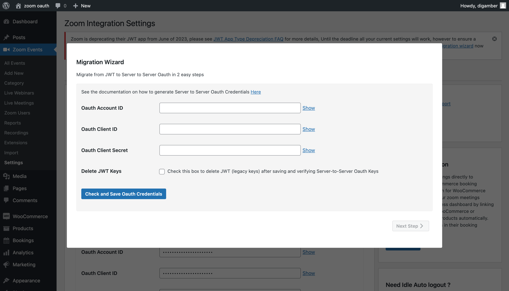

#Migration from JWT

##Reason
Previous versions of Video Conferencing with Zoom API ( version 3.9.7 and below) - used JWT credentials to connect and utlize zoom.
As of June 2023, Zoom will deprecate JWT App type - please see [JWT App Type Deprecation FAQ](https://marketplace.zoom.us/docs/guides/build/jwt-app/jwt-faq/)
From version 4.0.0 and above the plugin has moved to [Server-to-Server OAuth App](https://marketplace.zoom.us/docs/guides/build/server-to-server-oauth-app/) and [SDK App type](https://marketplace.zoom.us/docs/guides/build/sdk-app/) for Join via Browser / Web SDK support

##Migration Wizard
As of version 4.0.0 of Video Conferencing with Zoom Api users will see a migration wizard 

that prompts to add Server-to-Server OAuth Keys and App SDK keys to transition to new system.
Clicking on migration wizard will show you the migration wizard

###Step 1
First step is to add the OAuth App Credentials - you can follow the [steps in the setup guide](setup.md#generating-api-credentials) to generate Server-to-Server OAuth credentials.
- then add the Account ID, Client ID and Client Secret to the form shown below, checking the box Delete JWT Keys - will delete the JWT keys upon successfully validating and saving OAuth keys

 
Once saved successfully click Next Step

###Step 2
Step 2 will prompt you to add SDK App credentials, SDK Credentials are required to use Join via Browser feature without JWT, please see [steps in the setup guide](setup.md##generating-app-sdk-credentials) to generate App SDK credentials.
Then add the SDK Key and SDK Secret Key and Save App SDK Keys. Please note to test join via browser option on your site to verify you've added SDK keys correctly as it's the only way to verify you've entered the correct keys.

###Step 3 
You're all done - the keys have already been saved on Step 1 and Step 2, the migration is now complete.

