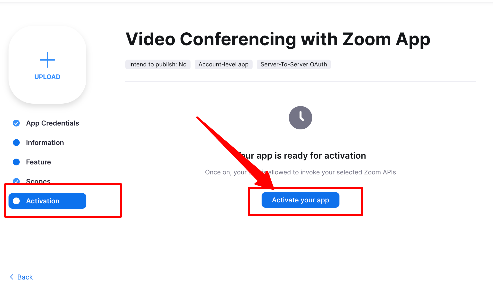
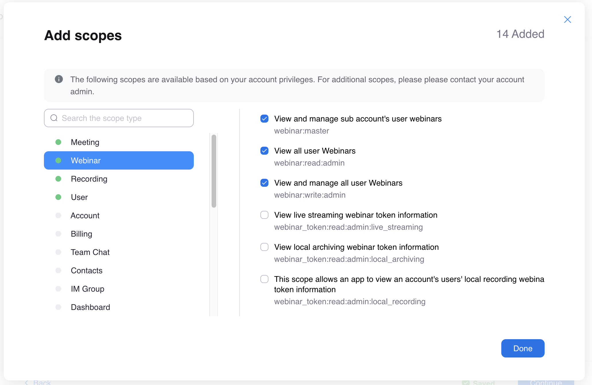
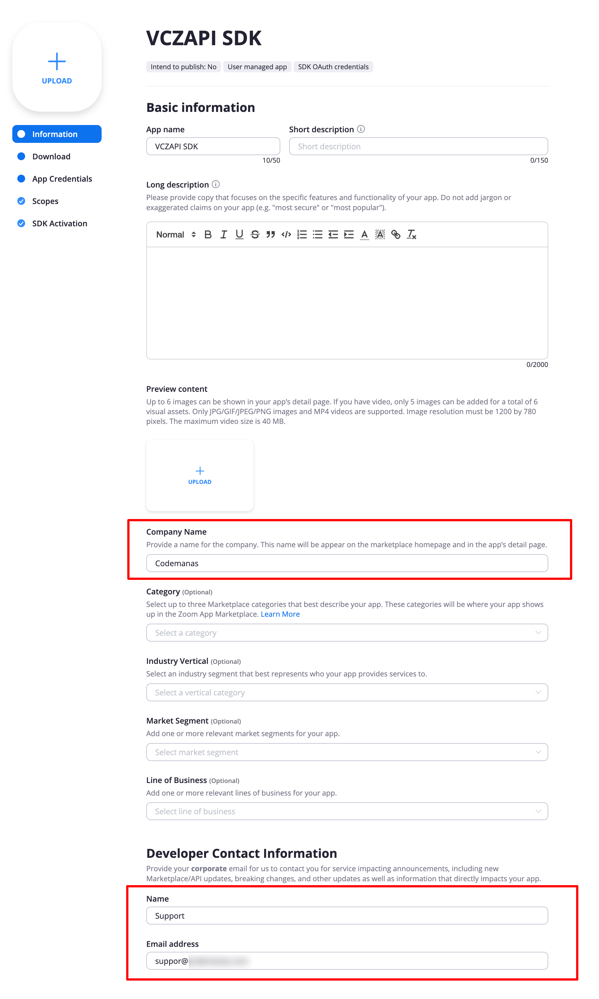
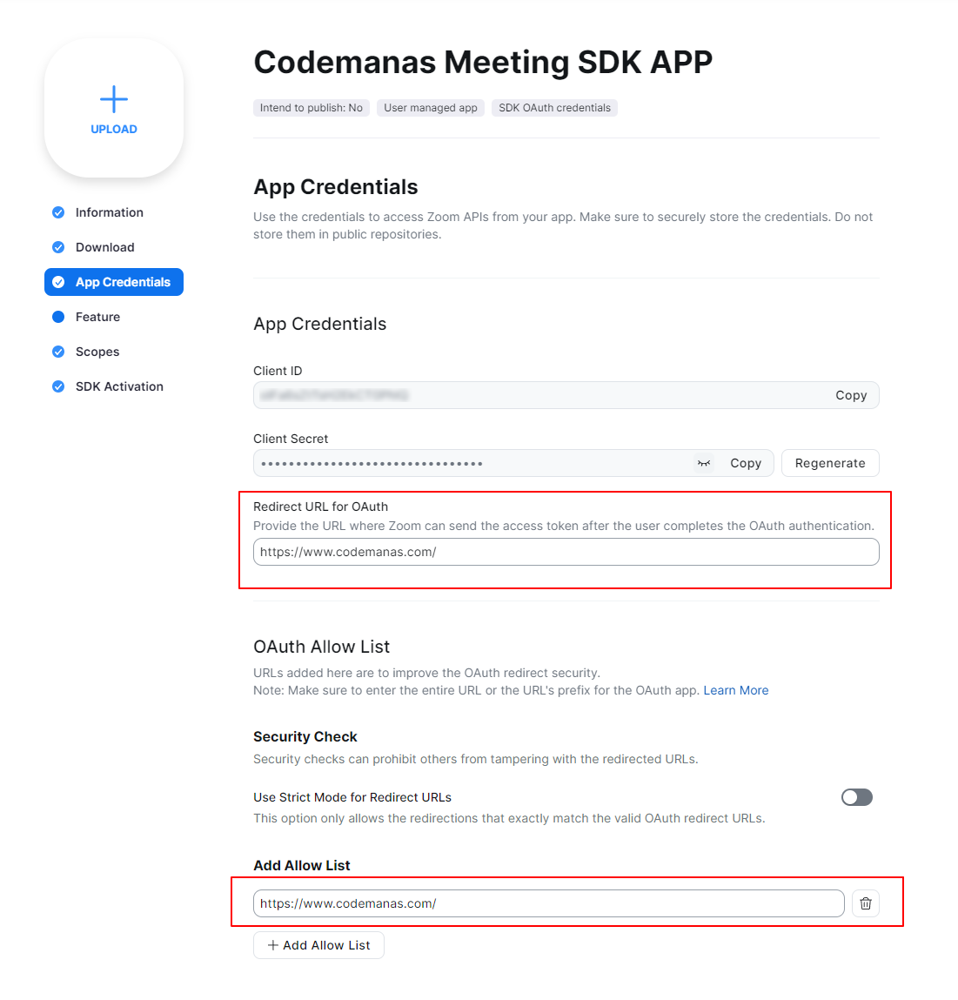
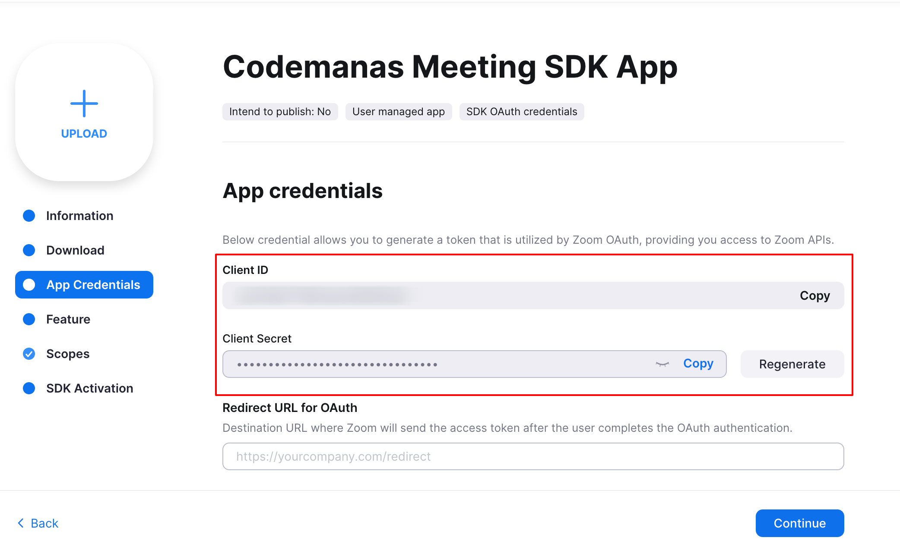

#Setup Video Conferencing with Zoom API

Here below are the steps to setup Zoom into WordPress.

## Getting Started

For [Video Conferening with Zoom](https://wordpress.org/plugins/video-conferencing-with-zoom-api/) plugin to work you will be using Server-to-Server OAuth app type.

**In order to setup the plugin you'll first need a Zoom Account. So, [sign up](https://zoom.us/signin#/login) if you don't have a Zoom account already or just sign in with your existing Zoom Account and follow the next steps.**

## Setup Server-to-Server OAuth

In order for you to setup the plugin, carefully follow all the steps below:

### Creating Server to Server App type

1. Goto Zoom Marketplace page from [https://marketplace.zoom.us/](https://marketplace.zoom.us/) 
2. Now, you will need to create a **"Server-to-Server"** App type from here.
3. Hover on **Manage** dropdown and select **"Build Server-to-Server App** like shown in below image.

   

**OR** you can simply click this [https://marketplace.zoom.us/develop/create](https://marketplace.zoom.us/develop/create) and this will open a modal like in below screenshot.

   

Click on **Server to Server OAuth App** and click **create**.

### Setting Up API Credentials:

After you click on **"Create"** button in the popup you will be asked few details to fill up.

#### 1. App Name

Add you app name to anything of your Preference so that you can remember that this app type is for your WordPress website.

#### 2. App Credentials

Once App is created - you will be taken to an App Overview page where you can see App Credentials. These highlighted credentials will be used in our WordPress Video conferencing Zoom plugin to connect with your account. We'll get back to this in next steps. Click **Continue** for now. 

#### 3. Information Page

In this next step you will need to add **Contact name, Contact email and Company name** on the information page in order to activate this app type. Fill in the details according to your needs. 

#### 4. Scopes Page

**Ignore "Feature" page** - After you've added details from previous step - Goto **Scopes** page from the left navigation menu and Click on **"Add Scopes"** as highlighted in the screenshot. 

Scopes are basically added in order to allow permissions to access your Zoom meetings into Video Conferencing Zoom plugin. So, this step is very crucial step and you should properly assign each of the defined scopes properly otherwise **you will get no permission issues when trying to create,delete or access Zoom Meetings from your WordPress site**.

See **[Required Scopes section](setup.md/#required-scopes).** in order to add necessary permissions. Come back to this step after you've added all the necessary permissions.

#### 5. Activation

Finally, click on **Activate your App** button and your activated.

### Required Scopes:

These below are the scopes required from step 4 when setting up the scopes for your application.

**Note: Not adding any of the below permissions may result in permission issue error notices when trying to create your meeting/webinars.**

#### Meetings
* View and manage sub account’s user meetings/meeting:master
* View all user meetings/meeting:read:admin
* View and manage all user meetings/meeting:write:admin

#### Recordings
* View and manage sub account’s user recordings/recording:master
* View all user recordings/recording:read:admin
* View and manage all user recordings/recording:write:admin

#### Reports
* View sub account’s report data/report:master
* View report data/report:read:admin
* View your chat history report/report_chat:read:admin

#### Users
* View and manage sub account’s user information/user:master
* View all user information/user:read:admin
* View users information and manage users/user:write:admin

#### Webinars
* View and manage sub account’s user webinars/webinar:master
* View all user Webinars/webinar:read:admin
* View and manage all user Webinars/webinar:write:admin

### Adding Server-to-Server OAuth Credentials to the plugin

Login to your WordPress site as an Administrator and goto WordPress admin dashboard page and goto **Zoom Events > Settings** page.

1. Go to Zoom Events > Settings > Connect tab 
2. Add the Server-to-Server credentials ( Account ID, Client ID, Client Secret ) that can be viewed in the app under credentials (see step 2 above from **Setting up API credentials step**) 

Click save to verify your credentials. If credentials are invalid, there should be a invalid warning. If everything is correctly setup then you should be able to see your Zoom Users from **wp-admin > Zoom Events > Users page.**

**Next step is to create new Zoom Events from wp-admin > Zoom Events > Add new page.**

## Setup App SDK Credentials

Purpose for creating a App SDK is required for Join via Browser/Web SDK to work properly.

### Generating App SDK Credentials
1. Click on **Build Legacy App** from Zoom marketplace page simply goto this corresponding link: [https://marketplace.zoom.us/develop/createLegacy](https://marketplace.zoom.us/develop/createLegacy)
2. Find **Meeting SDK** and click create 
3. The next screen will prompt you for an App Name & ask you if you want to publish this app on Zoom App Marketplace. **Add a name and toggle publish off** . 
4. Once App is created - you will need to add Company name, Name and Contact email 
5. Once the information has been added go to the App Credentials add Redirect URL for OAuth and Add Allow List. Then, copy SDK key(Client ID) and SDK Secret(Client Secret) and see Adding SDK credentials section. 
6. Ensure that your SDK app is activated in order to use the Join via browser features otherwise, you might get a **signature invalid error message.**

**
NOTE: In case you forgot to toggle the below button(shown in screenshot) you can still use the SDK credentials however, you won't be able to complete the SDK activation step. That's completely ok.
**

### Adding SDK Credentials to the plugin
1. Go to Zoom Events > Settings > Connect tab 
2. Add SDK credentials ( SDK Key and SDK Secret ) 
3. To test out join via browser - you will need to create a meeting and test if join via browser is working properly

You've not successfully connected your Zoom Account in your WordPress site. You should be able to create your Zoom meetings directly from your WordPress dashboard now.

### Next Steps

After you've configured your keys - Zoom meetings are not automatically imported into your site. You'll need to import your meetings or create new ones from your WordPress dashboard directly.

In order to create a new Zoom Meeting goto **wp-admin > Zoom Events > Add new** page and this should create a new meeting both in Zoom and as a post in your WordPress site as well.