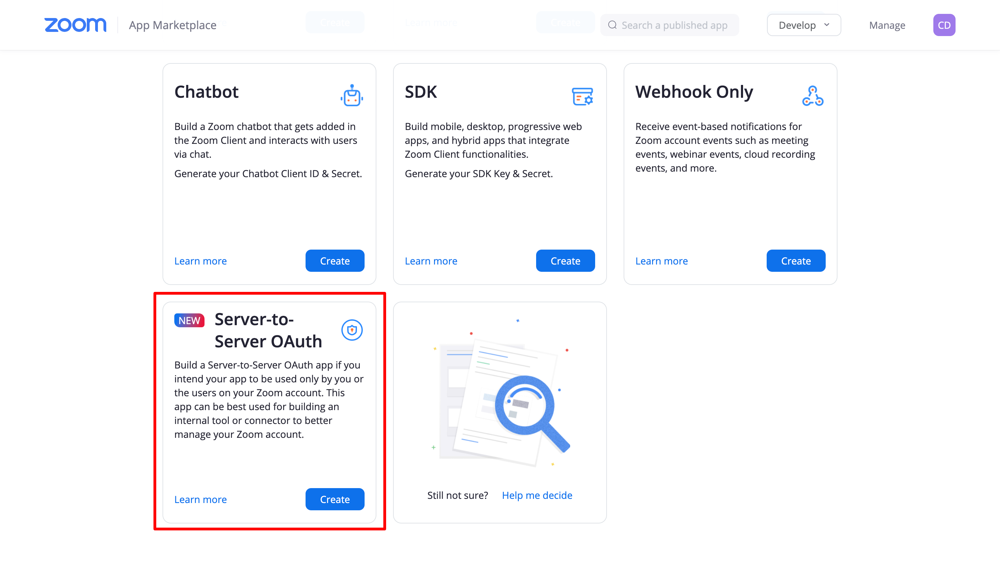
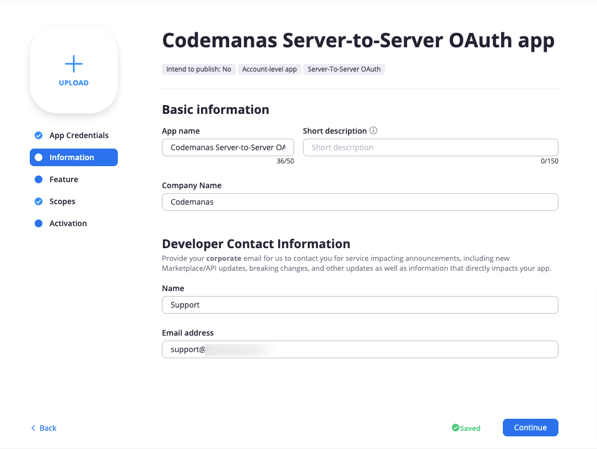

#Setup Video Conferencing with Zoom API

Here below are the steps to setup Zoom into WordPress.

From version 4.0.0 of Video Conferencing with Zoom API - the plugin has moved to Server-to-Server OAuth from JWT, this is because Zoom is deprecating JWT App type from June 2023,
For more info see [JWT App Type Depecation FAQ](https://marketplace.zoom.us/docs/guides/build/jwt-app/jwt-faq/), please see [migration guide](migration.md) to go to new Server-to-Server OAuth / App SDK

## Setup Server-to-Server OAuth

###Generating API Credentials:

For this plugin you will be using Server-to-Server OAuth app type.

**In order to setup the plugin you'll first need a Zoom Account. So, [sign up](https://zoom.us/signin#/login) if you don't have a Zoom account already or just sign in with your existing Zoom Account and follow the next steps.**

1. First go to [Create Page](https://marketplace.zoom.us/develop/create)
2. Find Server-to-Server OAuth and click create 
   
3. Add your app name 
4. Once App is created - you will be taken to an App Overview page where you can see App Credentials 
5. You will need to add Contact name, Contact email and Company name on the information page 
6. For the plugin to work - you will need to define the correct scopes for the App. Go to scopes and click "Add Scopes" and add Meeting, Webinar, Report, User, Recording, Report and select all options on each selected scopes. See below section for the exact permissions to add. 
7. Finally, activate the Server-to-Server App. 

###Below are permissions that are needed/required:

**Note: Not adding any of the below permissions may result in permission issue error notices when trying to create your meeting/webinars.**

####Meetings
* View and manage sub account’s user meetings/meeting:master
* View all user meetings/meeting:read:admin
* View and manage all user meetings/meeting:write:admin

####Recordings
* View and manage sub account’s user recordings/recording:master
* View all user recordings/recording:read:admin
* View and manage all user recordings/recording:write:admin

####Reports
* View sub account’s report data/report:master
* View report data/report:read:admin
* View your chat history report/report_chat:read:admin

####Users
* View and manage sub account’s user information/user:master
* View all user information/user:read:admin
* View users information and manage users/user:write:admin

####Webinars
* View and manage sub account’s user webinars/webinar:master
* View all user Webinars/webinar:read:admin
* View and manage all user Webinars/webinar:write:admin

###Adding Server-to-Server OAuth Credentials to the plugin
1. Go to Zoom Events > Settings > Connect tab 
2. Add the Server-to-Server credentials ( Account ID, Client ID, Client Secret ) that can be viewed in the app under credentials (see step 4 above) 

##Setup App SDK Credentials
App SDK are required for Join via Browser/Web SDK to work properly.

###Generating App SDK Credentials
1. Go to [Create Page](https://marketplace.zoom.us/develop/create)
2. Find SDK and click create 
3. The next screen will prompt you for an App Name & ask you if you want to publish this app on Zoom App Marketplace. **Add a name and toggle publish off** . 
4. Once App is created - you will need to add Company name, Name and Contact email 
5. Once the information has been added go to the App Credentials and copy SDK key(Client ID) and SDK Secret(Client Secret) and see Adding SDK credentials section. 
6. Ensure that your SDK app is activated in order to use the Join via browser features otherwise, you might get a **signature invalid error message.**

**
NOTE: In case you forgot to toggle the below button(shown in screenshot) you can still use the SDK credentials however, you won't be able to complete the SDK activation step. That's completely ok.
**

###Adding SDK Credentials to the plugin
1. Go to Zoom Events > Settings > Connect tab 
2. Add SDK credentials ( SDK Key and SDK Secret ) 
3. To test out join via browser - you will need to create a meeting and test if join via browser is working properly
