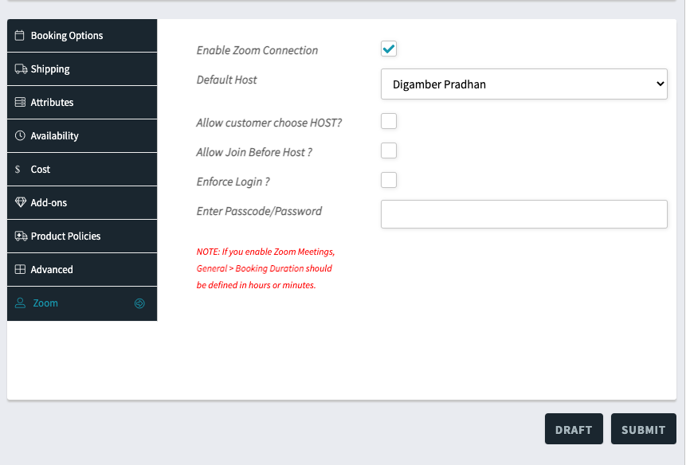
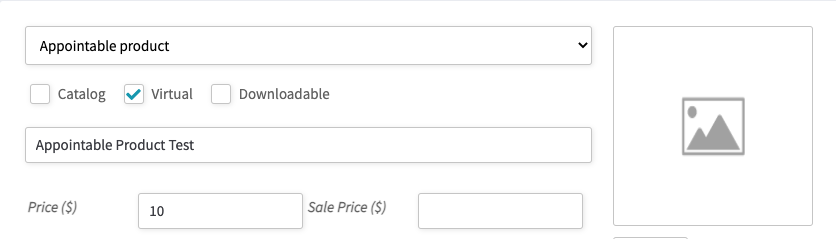

**This Addon is for WCFM – Frontend Manager for WooCommerce** you can get it [here](https://wordpress.org/plugins/wc-frontend-manager/).

## Zoom Integration for WooCommerce

### Introduction

Zoom Integration for WCFM acts as a glue plugin for Zoom integration for WooCommerce and WCFM. This addon allows vendors to create and manage Zoom Meeting Products from the front end.

### Demo Video

<iframe width="560" height="315" src="https://www.youtube.com/embed/TExAQpPSxPU" frameborder="0" allow="accelerometer; autoplay; encrypted-media; gyroscope; picture-in-picture" allowfullscreen></iframe>

### Prerequisites

1. Free version of [Video Conferencing with Zoom API ](https://wordpress.org/plugins/video-conferencing-with-zoom-api/)
2. WooCommerce [Download Here](https://wordpress.org/plugins/woocommerce/)
3. [WCFM – Frontend Manager for WooCommerce](https://wordpress.org/plugins/wc-frontend-manager/)
3. [Zoom integration for WooCommerce](https://www.codemanas.com/downloads/zoom-meetings-for-woocommerce/)
4. [Zoom Integration for WCFM](https://www.codemanas.com/downloads/wcfm-integration-for-zoom/)

### Instructions

After successfully installing all the required plugins. If you login as a vendor - you will be first shown a Zoom Meeting section on the WCFM dashboard.

1. Zoom Menu dashboard link
2. From this menu item vendors can create and mange Zoom Meetings. Vendors will oonly be able to see their own meetings. The vendors will only be able to see and attach meetings they create via their own dashboard. i.e they will not be able to see other users Meetings.
3. After meeting is created, the created meeting can be then attached to a product. Below screenshot show how the Zoom option should be shown on the frontend.

---

## Zoom Integration for WooCommerce and Bookings

Please see instructions for normal products [Zoom Integration for WooCommerce](#zoom-integration-for-woocommerce)

### Introduction

Zoom Integration for WCFM acts as a glue plugin for Zoom integration for WooCommerce and Bookings and WCFM. This addon allows vendors/shop owners to create bookable products and create a zoom meeting when a booking is made.

### Prerequisites for Bookable Product:

1. Free version of [Video Conferencing with Zoom API ](https://wordpress.org/plugins/video-conferencing-with-zoom-api/)
2. WooCommerce [Download Here](https://wordpress.org/plugins/woocommerce/)
3. [WCFM – Frontend Manager for WooCommerce](https://wordpress.org/plugins/wc-frontend-manager/)
4. [WOOCOMMERCE FRONTEND MANAGER – ULTIMATE](https://wclovers.com/product/woocommerce-frontend-manager-ultimate/)
5. [Zoom Integration for WCFM](https://www.codemanas.com/downloads/wcfm-integration-for-zoom/)
6. [WooCommerce Bookings](https://woocommerce.com/products/woocommerce-bookings/)
7. [Zoom Integration for WooCommerce and Bookings](https://www.codemanas.com/downloads/zoom-integration-for-woocommerce-booking/)

### Instructions:

Once all the required plugins are installed and activated. The ability to enable Zoom Meetings for Bookable Products will be available.

When you select bookable product via the WCFM frontend interface

---

---
You will see a new Zoom Setting Tab for the Bookable Product.

---

For detailed information on how Bookings and Zoom for WooCommerce and Bookings will work please see [Zoom for WooCommerce Bookings](woocommerce-booking.md)

## Zoom Integration for WooCommerce Appointments

### Introduction

Zoom Integration for WCFM acts as a glue plugin for Zoom integration for WooCommerce and WooCommerce Appointments and WCFM. This addon allows vendors/shop owners to create appointable products and create a zoom meeting when an appointment is made.

### Prerequisites for Bookable Product:

1. Free version of [Video Conferencing with Zoom API ](https://wordpress.org/plugins/video-conferencing-with-zoom-api/)
2. WooCommerce [Download Here](https://wordpress.org/plugins/woocommerce/)
3. [WCFM – Frontend Manager for WooCommerce](https://wordpress.org/plugins/wc-frontend-manager/)
4. [WOOCOMMERCE FRONTEND MANAGER – ULTIMATE](https://wclovers.com/product/woocommerce-frontend-manager-ultimate/)
5. [Zoom Integration for WCFM](https://www.codemanas.com/downloads/wcfm-integration-for-zoom/)
6. [WooCommerce Appointments](https://woocommerce.com/products/woocommerce-bookings/)
7. [Zoom for WooCommerce Appointments](https://www.codemanas.com/downloads/zoom-for-woocommerce-appointments/)

### Instructions:

Once all the required plugins are installed and activated. The ability to enable Zoom Meetings for Appointable Products will be available.

When you select Appointable product via the WCFM frontend interface:

---

---

You will see a new Zoom Setting Tab for the Appointable Product.

---

For detailed information on how Bookings and Zoom for WooCommerce Appointments will work please see [Zoom for WooCommerce Appointments](woocommerce-appointments.md)