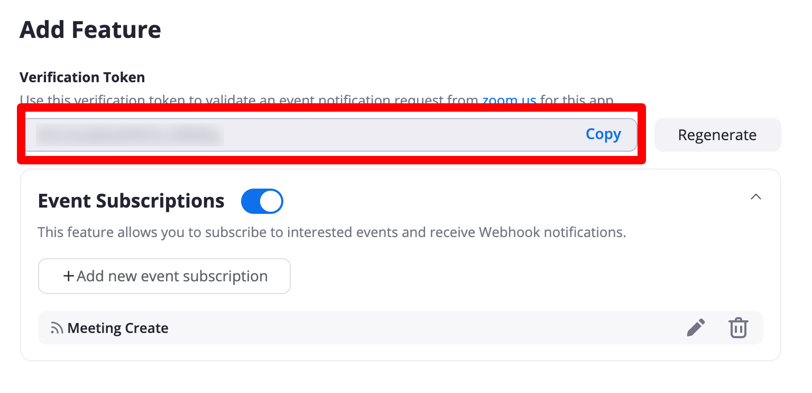
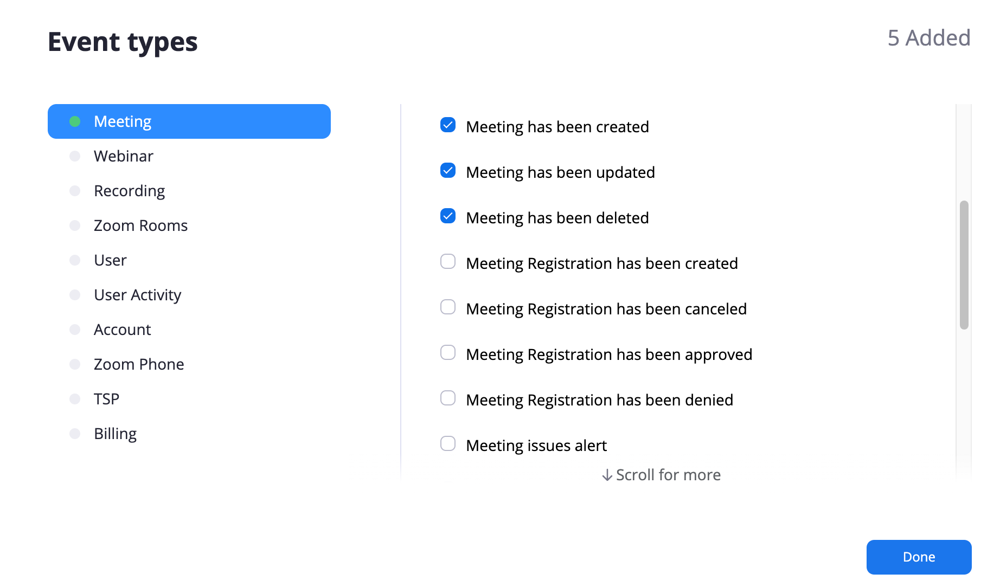

**_PLEASE READ: Webhook feature is currently in beta stage. So, we are gathering your feedbacks. Currently, only certain events are allowed to be used. We'll increase this as time goes by._**

### What is Web Hook ?

Zoom utilizes webhooks as a medium to notify this plugin (consumer application) about events that occur in a Zoom account. Instead of making repeated calls to pull data frequently from the Zoom API, you can use webhooks to get information on events that happen in a Zoom account.

In simple terms, webhook functionality can be used to notify your WordPress site to do something when a certain event is triggered in Zoom website. For example: if a user creates a meeting in Zoom website, it will be automatically created on your WordPress site as well.

### Requirements

1. This requires <a target="_blank" href="https://www.codemanas.com/downloads/video-conferencing-with-zoom-pro/">PRO version</a> of <a href="https://wordpress.org/plugins/video-conferencing-with-zoom-api/" target="_blank">Video Conferencing with Zoom</a> plugin.

2. Some Events might need a <a target="_blank" href="https://zoom.us/pricing">Zoom PRO</a> account as well. For example webinars, recurrings and PMI features.

### Initial Setup

* This section assumes that you have succesfully created a JWT token and API Keys have been added and succesfully connected to your WordPress site. If you have not created JWT token yet then please visit this [tutorial](/integration).

* Copy Verification Token Key.

* **_Event Subscriptions_** should be turned on from JWT app page inside "**_Features_**" section

* After that click on **Add new Event Subscription button**

### Getting Endpoint URLs

Goto **wp-admin > Zoom Meetings > Settings > Webhooks**

Each endpoint for certain events are defined in this page. All you need to do is copy it from here to Zoom side. See below for where to copy these URLs.

### Automate Meeting Flow

* Click on **Add new Event Subscription button**
* Add Subscription name to **Meeting** or something that would make you remember the purpose of this.
* In **Event notification endpoint URL** text box area. Copy URL your **wp-admin > Zoom Meetings > Settings > Webhooks > Meetings**. For example it should be something like **https://yoursite.com/wp-json/vczapi/v1/meeting** to **Event notification endpoint URL** text area.

* Click on **Add Events**

* Select 5 events which are **`"Meeting has been created", "Meeting has been updated", "Meeting has been deleted", "Meeting has been recovered" and "Meeting has been permanently deleted"`**

Please note that choosing any additional events will not work.

